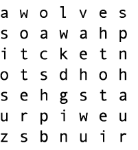

# Word Search

## Summary
In this challenge we're going to write a search algorithm that will tell us whether or not a word can be found in a [word search puzzle][wikipedia word search].  The specific rules that we need to follow will be detailed in the releases.


### Puzzle Data Structure
```ruby
puzzle = [
  ["a", "w", "o", "l", "v", "e", "s"], 
  ["s", "o", "a", "w", "a", "h", "p"], 
  ["i", "t", "c", "k", "e", "t", "n"],
  ["o", "t", "s", "d", "h", "o", "h"],
  ["s", "e", "h", "g", "s", "t", "a"],
  ["u", "r", "p", "i", "w", "e", "u"],
  ["z", "s", "b", "n", "u", "i", "r"]
]
```
*Figure 1*. Representing a word search puzzle as a nested array

We'll be representing our word search puzzles as nested arrays.  The puzzle as a whole will be represented by the outer array.  Each row in the puzzle will be represented by one of the inner arrays.  (see Figure 1)


## Releases
### Release 0: Finding Words in a Straight Line
  
*Figure 2*.  Finding the words *wolves*, *otters*, and *bison* in straight lines.

In this first release, we're going to write a `straight_line_include?` method.  Our method will accept two arguments:  (1) a word we're looking for and (2) a word search puzzle modeled as a nested array.  The method will return `true` if the word can be found in the puzzle and `false` if not.  We're going to follow traditional word search behavior and only allow words to be found in straight lines (see Figure 2).

As always, we'll need to document the behavior of our method with tests.

**Rules**  
- Words can be found in horizontal, vertical, and diagonal lines.
- Words can be spelled forward and backward.


### Release 1: Finding Snaking Words
  
*Figure 3*.  Finding the word *nighthawks* with letters that snake through the puzzle.

In this release, we're going to write a `snaking_include?` method.  This method will accept the same arguments as our `straight_line_include?` method and return the same values, but the algorithm used to search for words will be different.  We'll remove the restriction that words need to appear in a single row, column, or diagonal.  Instead, we'll allow the letters of words to snake through the puzzle (see Figure 3).

We'll need to test this method as well.

**Rules**  
- Words can snake horizontally, vertically, and diagonally.
- Each letter in the puzzle can be used only once per word. 


### Release 2:  Build a User Interface
In the `runner.rb` file, let's write a script that displays a word search puzzle to users and asks them to input words for which to search.  After each word is input, we should report whether or not the word could be found in the puzzle.

If the word is found, can we visually show the word to users?


## Conclusion
The snaking algorithm is one of the more difficult challenges with which we're presented during Dev Bootcamp.  How do we feel about it?  Did it go well?  Where did we struggle?

How was our testing approach?  Did we start with simpler words to find?  Maybe a one-letter word, followed by a two letter and so on?  


[wikipedia word search]: https://en.wikipedia.org/wiki/Word_search